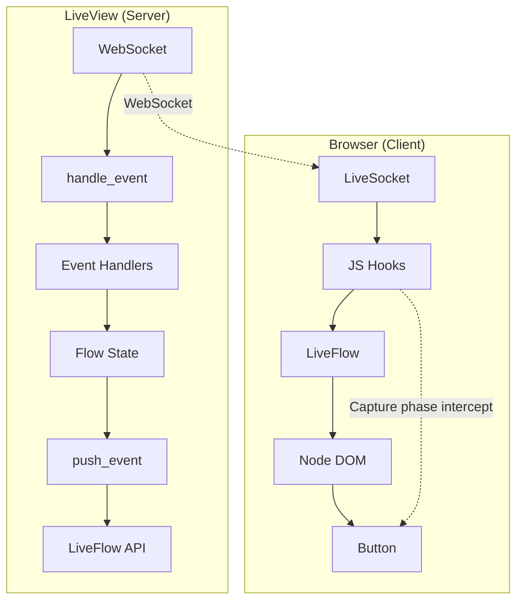
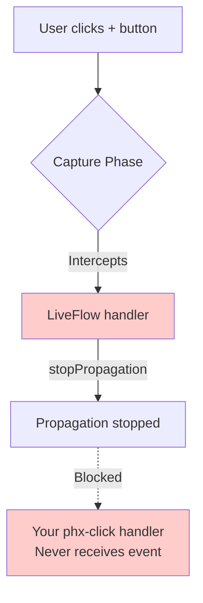
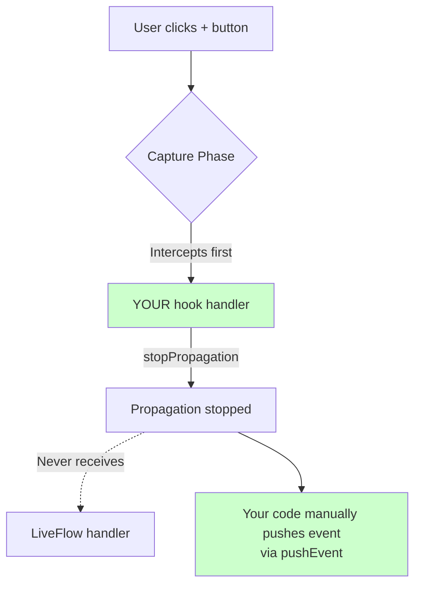
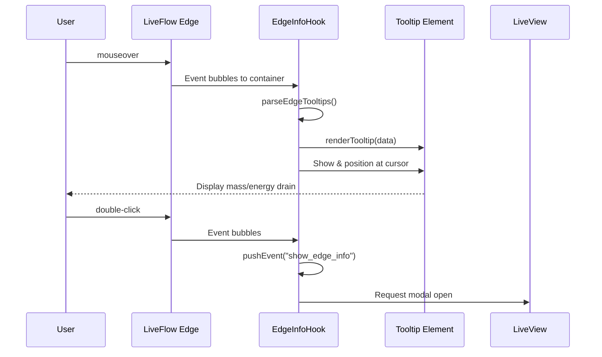

# How To: Integrate LiveFlow with Phoenix LiveView

This guide documents the integration of LiveFlow (a visual workflow editor library) with Phoenix LiveView, with special focus on handling interaction conflicts between LiveFlow's drag/selection system and custom UI controls inside nodes.

## Table of Contents

1. [Overview](#overview)
2. [Basic Integration Pattern](#basic-integration-pattern)
3. [The Interaction Problem](#the-interaction-problem)
4. [Solution: Capture-Phase Event Hooks](#solution-capture-phase-event-hooks)
5. [Complete Examples](#complete-examples)
6. [Edge Hover Tooltip](#edge-hover-tooltip-simulation-mode)
7. [Troubleshooting](#troubleshooting)

---

## Overview

LiveFlow provides a visual node-based editor with drag-and-drop capabilities. When embedding custom interactive elements (buttons, inputs) inside nodes, LiveFlow's event handlers can intercept clicks, causing a frustrating UX where the first click only selects the node instead of triggering the button.

### Common Scenarios Requiring This Fix

- Edit buttons inside workflow nodes
- Quantity +/- buttons inside unit nodes
- Any interactive controls within draggable node content

---

## Basic Integration Pattern

### Architecture



---

## The Interaction Problem

### Problem Description

When users click interactive elements (buttons) inside a workflow node for the **first time**:

1. **Expected**: Button click triggers immediately
2. **Actual**: Click is intercepted by LiveFlow's drag/selection handlers
3. **Result**: Node gets selected instead; button doesn't respond
4. **Second click**: Works because node is already selected

### Root Cause

LiveFlow attaches pointer event handlers to the node container to enable:
- Dragging nodes
- Multi-selection
- Connection creation

These handlers use the **capture phase** and call `stopPropagation()`, preventing your button's `phx-click` from receiving the event.

### Event Flow (Problematic)



---

## Solution: Capture-Phase Event Hooks

### Strategy

Intercept the event **before** LiveFlow can capture it, using:
1. **Capture-phase event listeners** (`{ capture: true }`)
2. **Immediate propagation stopping** (`stopPropagation()`, `stopImmediatePropagation()`)
3. **Manual event pushing** via `this.pushEvent()`

### Event Flow (Fixed)



### Hook Implementation Pattern

```javascript
// assets/js/app.js

const ButtonInsideNodeHook = {
  mounted() {
    // Prevent LiveFlow's mousedown handler from starting drag
    this.handleMouseDown = (e) => {
      e.preventDefault()
      e.stopPropagation()
    }
    
    // Handle the actual click
    this.handleClick = (e) => {
      // Stop ALL propagation immediately
      e.preventDefault()
      e.stopPropagation()
      e.stopImmediatePropagation()
      
      // Extract event details from data attributes
      const eventName = this.el.getAttribute("data-event")
      const nodeId = this.el.getAttribute("data-node-id")
      
      if (eventName) {
        // Small delay to ensure clean event processing
        setTimeout(() => {
          this.pushEvent(eventName, { "node-id": nodeId })
        }, 50)
      }
      
      return false
    }
    
    // CRITICAL: Use capture phase to intercept before LiveFlow
    this.el.addEventListener("mousedown", this.handleMouseDown, { capture: true })
    this.el.addEventListener("click", this.handleClick, { capture: true })
  },
  
  destroyed() {
    // Clean up to prevent memory leaks
    this.el.removeEventListener("mousedown", this.handleMouseDown, { capture: true })
    this.el.removeEventListener("click", this.handleClick, { capture: true })
  }
}

// Register in LiveSocket
const liveSocket = new LiveSocket("/live", Socket, {
  hooks: {
    ButtonInsideNode: ButtonInsideNodeHook
  }
})
```

### Key Implementation Details

#### 1. Capture Phase is Essential

```javascript
// WRONG - bubble phase, LiveFlow already captured it
this.el.addEventListener("click", this.handleClick)

// CORRECT - capture phase, intercept before LiveFlow
this.el.addEventListener("click", this.handleClick, { capture: true })
```

#### 2. Stop All Propagation

```javascript
this.handleClick = (e) => {
  e.preventDefault()           // Prevent default browser behavior
  e.stopPropagation()          // Stop bubbling up
  e.stopImmediatePropagation() // Stop other handlers on same element
  // ...
}
```

#### 3. Use setTimeout for pushEvent

The small delay ensures:
- Event propagation is fully stopped
- LiveFlow's state settles
- Clean event processing

```javascript
setTimeout(() => {
  this.pushEvent(eventName, { "node-id": nodeId })
}, 50)
```

---

## Complete Examples

### Example 1: Edit Button in Unit Node

**JavaScript Hook:**
```javascript
// assets/js/app.js

const EditButtonHook = {
  mounted() {
    this.handleMouseDown = (e) => {
      e.preventDefault()
      e.stopPropagation()
    }
    
    this.handleClick = (e) => {
      e.preventDefault()
      e.stopPropagation()
      e.stopImmediatePropagation()
      
      const eventName = this.el.getAttribute("data-event")  // "open_unit_selector"
      const nodeId = this.el.getAttribute("data-node-id")
      
      if (eventName) {
        setTimeout(() => {
          this.pushEvent(eventName, { "node-id": nodeId })
        }, 100)  // Longer delay for modals
      }
      
      return false
    }
    
    this.el.addEventListener("mousedown", this.handleMouseDown, { capture: true })
    this.el.addEventListener("click", this.handleClick, { capture: true })
  },
  
  destroyed() {
    this.el.removeEventListener("mousedown", this.handleMouseDown, { capture: true })
    this.el.removeEventListener("click", this.handleClick, { capture: true })
  }
}
```

**LiveComponent Template:**
```elixir
<%# lib/my_app_web/live/workflow/unit_node.ex %>
<button
  type="button"
  class="workflow-node-unit-edit-btn"
  id={"unit-edit-btn-#{@node.id}"}        <%# Unique ID required for hook %>
  phx-hook="EditButton"                    <%# Attach hook %>
  data-event="open_unit_selector"          <%# Event to trigger %>
  data-node-id={@node.id}                  <%# Context data %>
  title="Change unit"
>
  <.icon name="hero-pencil-square" class="w-3 h-3" />
</button>
```

**LiveView Handler:**
```elixir
# lib/my_app_web/live/workflow_live.ex

def handle_event("open_unit_selector", %{"node-id" => node_id}, socket) do
  {:noreply, 
   assign(socket, 
     show_unit_selector: true,
     selected_node_id: node_id
   )}
end
```

### Example 2: Quantity +/- Buttons

**JavaScript Hook:**
```javascript
// assets/js/app.js

const QuantityButtonHook = {
  mounted() {
    this.handleMouseDown = (e) => {
      e.preventDefault()
      e.stopPropagation()
    }
    
    this.handleClick = (e) => {
      e.preventDefault()
      e.stopPropagation()
      e.stopImmediatePropagation()
      
      const eventName = this.el.getAttribute("data-event")
      const nodeId = this.el.getAttribute("data-node-id")
      
      if (eventName) {
        setTimeout(() => {
          this.pushEvent(eventName, { "node-id": nodeId })
        }, 50)
      }
      
      return false
    }
    
    this.el.addEventListener("mousedown", this.handleMouseDown, { capture: true })
    this.el.addEventListener("click", this.handleClick, { capture: true })
  },
  
  destroyed() {
    this.el.removeEventListener("mousedown", this.handleMouseDown, { capture: true })
    this.el.removeEventListener("click", this.handleClick, { capture: true })
  }
}
```

**LiveComponent Template:**
```elixir
<%# lib/my_app_web/live/workflow/unit_node.ex %>
<div class="workflow-node-unit-quantity">
  <%# Decrease button %>
  <button
    type="button"
    class="workflow-node-unit-qty-btn"
    id={"qty-minus-btn-#{@node.id}"}
    phx-hook="QuantityButton"
    data-event="decrease_quantity"
    data-node-id={@node.id}
    disabled={@quantity <= 1}
  >
    <.icon name="hero-minus" class="w-3 h-3" />
  </button>
  
  <span class="workflow-node-unit-qty-value">{@quantity}</span>
  
  <%# Increase button %>
  <button
    type="button"
    class="workflow-node-unit-qty-btn"
    id={"qty-plus-btn-#{@node.id}"}
    phx-hook="QuantityButton"
    data-event="increase_quantity"
    data-node-id={@node.id}
  >
    <.icon name="hero-plus" class="w-3 h-3" />
  </button>
</div>
```

**LiveView Handlers:**
```elixir
def handle_event("increase_quantity", %{"node-id" => node_id}, socket) do
  flow =
    update_node_data(socket.assigns.flow, node_id, fn data ->
      current_qty = data[:quantity] || 1
      %{data | quantity: current_qty + 1}
    end)

  {:noreply, assign(socket, flow: flow, simulation_run: false)}
end

def handle_event("decrease_quantity", %{"node-id" => node_id}, socket) do
  flow =
    update_node_data(socket.assigns.flow, node_id, fn data ->
      current_qty = data[:quantity] || 1
      new_qty = max(1, current_qty - 1)
      %{data | quantity: new_qty}
    end)

  {:noreply, assign(socket, flow: flow, simulation_run: false)}
end
```

---

## Complete Integration File

### assets/js/app.js (Full Example)

```javascript
import { Socket } from "phoenix"
import { LiveSocket } from "phoenix_live_view"
import { LiveFlowHook, FileImportHook, setupDownloadHandler } from "live_flow"

// Hook for edit buttons inside workflow nodes
const EditButtonHook = {
  mounted() {
    this.handleMouseDown = (e) => {
      e.preventDefault()
      e.stopPropagation()
    }
    
    this.handleClick = (e) => {
      e.preventDefault()
      e.stopPropagation()
      e.stopImmediatePropagation()
      
      const eventName = this.el.getAttribute("data-event")
      const nodeId = this.el.getAttribute("data-node-id")
      
      if (eventName) {
        setTimeout(() => {
          this.pushEvent(eventName, { "node-id": nodeId })
        }, 100)
      }
      
      return false
    }
    
    this.el.addEventListener("mousedown", this.handleMouseDown, { capture: true })
    this.el.addEventListener("click", this.handleClick, { capture: true })
  },
  
  destroyed() {
    this.el.removeEventListener("mousedown", this.handleMouseDown, { capture: true })
    this.el.removeEventListener("click", this.handleClick, { capture: true })
  }
}

// Hook for quantity +/- buttons inside workflow nodes
const QuantityButtonHook = {
  mounted() {
    this.handleMouseDown = (e) => {
      e.preventDefault()
      e.stopPropagation()
    }
    
    this.handleClick = (e) => {
      e.preventDefault()
      e.stopPropagation()
      e.stopImmediatePropagation()
      
      const eventName = this.el.getAttribute("data-event")
      const nodeId = this.el.getAttribute("data-node-id")
      
      if (eventName) {
        setTimeout(() => {
          this.pushEvent(eventName, { "node-id": nodeId })
        }, 50)
      }
      
      return false
    }
    
    this.el.addEventListener("mousedown", this.handleMouseDown, { capture: true })
    this.el.addEventListener("click", this.handleClick, { capture: true })
  },
  
  destroyed() {
    this.el.removeEventListener("mousedown", this.handleMouseDown, { capture: true })
    this.el.removeEventListener("click", this.handleClick, { capture: true })
  }
}

const csrfToken = document.querySelector("meta[name='csrf-token']").getAttribute("content")
const liveSocket = new LiveSocket("/live", Socket, {
  longPollFallbackMs: 2500,
  params: { _csrf_token: csrfToken },
  hooks: {
    LiveFlow: LiveFlowHook,
    FileImport: FileImportHook,
    EditButton: EditButtonHook,
    QuantityButton: QuantityButtonHook
  },
})

setupDownloadHandler()
liveSocket.connect()
window.liveSocket = liveSocket
```

---

## Edge Hover Tooltip (Simulation Mode)

This section explains how to implement a custom hover tooltip on edges during simulation mode.

### Overview

When running a workflow simulation, hovering over edges displays a floating tooltip with eco statistics (mass/energy drain). Double-clicking opens a detailed modal.



### Architecture

#### Data Flow

1. **Server (LiveView)**: Encodes edge data as JSON in container's `data-edge-tooltips` attribute
2. **Client (JS Hook)**: Parses JSON, creates tooltip element, handles mouse events
3. **Display**: Tooltip follows cursor, shows formatted eco data

```mermaid
flowchart TB
    subgraph Server["LiveView (Server)"]
        RS[run_simulation handler]
        BET[build_edge_tooltips/2]
        DATA[data-edge-tooltips JSON]
        
        RS --> BET
        BET --> DATA
    end
    
    DATA -.->|render| Container
    
    subgraph Client["Browser (Client)"]
        Container[Container with phx-hook="EdgeInfo"]
        EIH[EdgeInfoHook]
        PARSE[parseEdgeTooltips]
        RENDER[renderTooltip]
        TOOLTIP[Floating Tooltip]
        EDGE[.lf-edge element]
        
        Container --> EIH
        EIH --> PARSE
        EIH --> EDGE
        EDGE -->|mouseover| RENDER
        RENDER --> TOOLTIP
    end
```

### Implementation

#### Step 1: LiveView - Prepare Edge Data

```elixir
# lib/my_app_web/live/workflow_live.ex

defp build_edge_tooltips(edges, true = _simulation_run) do
  tooltips =
    Enum.reduce(edges, %{}, fn {id, edge}, acc ->
      data = edge.data || %{}

      if data[:simulation_run] do
        mass = data[:mass_per_sec] || 0
        energy = data[:energy_per_sec] || 0

        # Return structured data for the tooltip
        tooltip_data = %{
          mass: format_tooltip_value(mass),
          energy: format_tooltip_value(energy)
        }

        Map.put(acc, id, tooltip_data)
      else
        acc
      end
    end)

  Jason.encode!(tooltips)
end

defp format_tooltip_value(value) when is_float(value) do
  if trunc(value) == value do
    trunc(value)
  else
    Float.round(value, 1)
  end
end

defp format_tooltip_value(value) when is_integer(value), do: value
defp format_tooltip_value(_), do: 0
```

#### Step 2: LiveView - Container with Hook

```elixir
# In your LiveView template
<div
  id="eco-workflow-container"
  data-simulation-run={to_string(@simulation_run)}
  data-edge-tooltips={build_edge_tooltips(@flow.edges, @simulation_run)}
  phx-hook="EdgeInfo"
>
  <.live_component
    module={LiveFlow.Components.Flow}
    id="workflow-flow"
    flow={@flow}
    # ... other props
  />
</div>
```

**Key Points:**
- Hook is attached to a **container** element wrapping LiveFlow, not individual edges
- `data-edge-tooltips` contains JSON mapping edge IDs to tooltip data
- `data-simulation-run` controls whether tooltips are shown

#### Step 3: JavaScript - EdgeInfo Hook

```javascript
// assets/js/hooks/edge_info.js

const EdgeInfoHook = {
  mounted() {
    // Parse edge tooltips from data attribute
    this.parseEdgeTooltips()

    // Create tooltip element (initially hidden)
    this.tooltip = document.createElement('div')
    this.tooltip.className = 'edge-hover-tooltip'
    this.tooltip.style.cssText = `
      position: fixed;
      display: none;
      z-index: 1000;
      /* ... other styles */
    `
    document.body.appendChild(this.tooltip)

    // Mouse over - show tooltip
    this.handleMouseOver = (e) => {
      if (!this.isSimulationRunning()) return

      const edgeEl = e.target.closest('.lf-edge-interaction, .lf-edge')
      if (!edgeEl) return

      const edgeId = edgeEl.dataset.edgeId
      if (!edgeId) return

      const tooltipData = this.edgeTooltips[edgeId]
      if (tooltipData) {
        this.renderTooltip(tooltipData)
        this.tooltip.style.display = 'block'
        this.updateTooltipPosition(e)
      }
    }

    // Mouse move - update position
    this.handleMouseMove = (e) => {
      if (this.tooltip.style.display === 'block') {
        this.updateTooltipPosition(e)
      }
    }

    // Mouse out - hide tooltip
    this.handleMouseOut = (e) => {
      const relatedTarget = e.relatedTarget
      if (!relatedTarget || !relatedTarget.closest('.lf-edge-group')) {
        this.tooltip.style.display = 'none'
      }
    }

    // Double-click - open modal
    this.handleDoubleClick = (e) => {
      if (!this.isSimulationRunning()) return

      const edgeEl = e.target.closest('.lf-edge-interaction, .lf-edge')
      if (!edgeEl) return

      const edgeId = edgeEl.dataset.edgeId
      if (edgeId) {
        e.preventDefault()
        e.stopPropagation()
        this.pushEvent("show_edge_info", { "edge_id": edgeId })
      }
    }

    // Attach listeners to container (events bubble from edges)
    this.el.addEventListener('mouseover', this.handleMouseOver)
    this.el.addEventListener('mousemove', this.handleMouseMove)
    this.el.addEventListener('mouseout', this.handleMouseOut)
    this.el.addEventListener('dblclick', this.handleDoubleClick, true)
  },

  updated() {
    // Re-parse after DOM update (LiveView re-renders)
    this.parseEdgeTooltips()
  },

  parseEdgeTooltips() {
    try {
      const tooltipsJson = this.el.dataset.edgeTooltips || '{}'
      this.edgeTooltips = JSON.parse(tooltipsJson)
    } catch (e) {
      this.edgeTooltips = {}
    }
  },

  isSimulationRunning() {
    return this.el.dataset.simulationRun === "true"
  },

  renderTooltip(data) {
    const formatValue = (val) => {
      if (typeof val === 'number') {
        return Number.isInteger(val) ? val.toString() : val.toFixed(1)
      }
      return '0'
    }

    this.tooltip.innerHTML = `
      <div class="tooltip-row mass-row">
        <span class="tooltip-label">Mass</span>
        <span class="tooltip-value">-${formatValue(data.mass)}/s</span>
      </div>
      <div class="tooltip-row energy-row">
        <span class="tooltip-label">Energy</span>
        <span class="tooltip-value">-${formatValue(data.energy)}/s</span>
      </div>
      <div class="tooltip-hint">Double-click for details</div>
    `
  },

  updateTooltipPosition(e) {
    const tooltipRect = this.tooltip.getBoundingClientRect()

    // Position above cursor
    let x = e.clientX - tooltipRect.width / 2
    let y = e.clientY - tooltipRect.height - 15

    // Keep within viewport
    const padding = 10
    x = Math.max(padding, Math.min(x, window.innerWidth - tooltipRect.width - padding))
    y = Math.max(padding, y)

    this.tooltip.style.left = x + 'px'
    this.tooltip.style.top = y + 'px'
  },

  destroyed() {
    this.el.removeEventListener('mouseover', this.handleMouseOver)
    this.el.removeEventListener('mousemove', this.handleMouseMove)
    this.el.removeEventListener('mouseout', this.handleMouseOut)
    this.el.removeEventListener('dblclick', this.handleDoubleClick, true)

    if (this.tooltip && this.tooltip.parentNode) {
      this.tooltip.parentNode.removeChild(this.tooltip)
    }
  }
}

export { EdgeInfoHook }
```

#### Step 4: Register Hook

```javascript
// assets/js/app.js

import { EdgeInfoHook } from "./hooks/edge_info"

const liveSocket = new LiveSocket("/live", Socket, {
  hooks: {
    EdgeInfo: EdgeInfoHook,
    // ... other hooks
  }
})
```

#### Step 5: CSS Styling

```css
/* assets/css/workflow.css */

.edge-hover-tooltip {
  position: fixed;
  background: #1f2937;
  border: 1px solid #374151;
  border-radius: 8px;
  padding: 12px 16px;
  box-shadow: 0 4px 12px rgba(0, 0, 0, 0.3);
  font-size: 14px;
  pointer-events: none;
  z-index: 1000;
  display: none;
  min-width: 140px;
}

.tooltip-row {
  display: flex;
  justify-content: space-between;
  gap: 12px;
  padding: 6px 0;
}

.tooltip-row.mass-row {
  border-left: 3px solid #06b6d4;
  padding-left: 8px;
}

.tooltip-row.energy-row {
  border-left: 3px solid #f59e0b;
  padding-left: 8px;
}

.tooltip-value {
  font-weight: 700;
  font-family: monospace;
}

.tooltip-hint {
  margin-top: 8px;
  padding-top: 6px;
  border-top: 1px dashed #4b5563;
  font-size: 10px;
  color: #6b7280;
  font-style: italic;
  text-align: center;
}
```

### Key Implementation Details

#### 1. Event Delegation Pattern

Instead of attaching listeners to each edge (which are dynamically created/destroyed), we use **event delegation** on the container:

```javascript
// Container listens, events bubble from edges
this.el.addEventListener('mouseover', this.handleMouseOver)

// Then find the specific edge
const edgeEl = e.target.closest('.lf-edge-interaction, .lf-edge')
```

#### 2. Positioning Strategy

The tooltip is `position: fixed` and appended to `document.body` to escape any stacking context issues within LiveFlow's SVG:

```javascript
// Create once, reuse
document.body.appendChild(this.tooltip)

// Position relative to viewport
this.tooltip.style.left = x + 'px'
this.tooltip.style.top = y + 'px'
```

#### 3. Data Flow via Dataset

LiveView encodes data as a JSON string in the HTML:

```html
<div data-edge-tooltips='{"edge-1": {"mass": 3.7, "energy": 45.2}}'>
```

JavaScript parses this on mount and after each update:

```javascript
updated() {
  this.parseEdgeTooltips()  // Re-parse after LiveView re-render
}
```

#### 4. Simulation State Check

Tooltips only appear during simulation mode:

```javascript
this.handleMouseOver = (e) => {
  if (!this.isSimulationRunning()) return
  // ... show tooltip
}
```

### Double-Click for Modal

To show detailed info on double-click:

```javascript
this.handleDoubleClick = (e) => {
  const edgeId = edgeEl.dataset.edgeId
  this.pushEvent("show_edge_info", { "edge_id": edgeId })
}
```

**LiveView Handler:**

```elixir
def handle_event("show_edge_info", %{"edge_id" => edge_id}, socket) do
  {:noreply,
   assign(socket,
     show_edge_info: true,
     selected_edge_id: edge_id
   )}
end
```

### Troubleshooting Edge Tooltips

#### Issue: Tooltip doesn't appear

**Check:**
1. ✅ Hook registered as `EdgeInfo: EdgeInfoHook` in LiveSocket
2. ✅ Container has `phx-hook="EdgeInfo"`
3. ✅ `data-edge-tooltips` contains valid JSON
4. ✅ `data-simulation-run="true"` is set
5. ✅ Edge elements have `data-edge-id` attribute

#### Issue: Tooltip position is wrong

**Fix:** Force layout measurement before positioning:

```javascript
updateTooltipPosition(e) {
  // First position off-screen to get dimensions
  this.tooltip.style.left = '-9999px'
  const rect = this.tooltip.getBoundingClientRect()

  // Then calculate proper position
  let x = e.clientX - rect.width / 2
  // ...
}
```

#### Issue: Tooltip flickers

**Cause:** Mouse events firing rapidly on SVG elements.

**Fix:** Use `mouseout` with `relatedTarget` check:

```javascript
this.handleMouseOut = (e) => {
  // Only hide if actually leaving the edge, not entering child element
  const relatedTarget = e.relatedTarget
  if (!relatedTarget || !relatedTarget.closest('.lf-edge-group')) {
    this.tooltip.style.display = 'none'
  }
}
```

---

## Troubleshooting

### Issue: Button still doesn't work on first click

**Checklist:**
1. ✅ Hook is registered in `LiveSocket` configuration
2. ✅ Element has unique `id` attribute
3. ✅ Event listeners use `{ capture: true }`
4. ✅ Calling `stopImmediatePropagation()`
5. ✅ Using `setTimeout` before `pushEvent`

### Issue: Event fires but LiveView handler not called

**Verify param naming:**
```javascript
// JavaScript sends:
this.pushEvent("my_event", { "node-id": node_id })

// Elixir expects:
def handle_event("my_event", %{"node-id" => node_id}, socket) do
  # ...
end
```

### Issue: Multiple events firing

**Cause:** Missing `stopImmediatePropagation()` or not cleaning up listeners.

**Fix:**
```javascript
destroyed() {
  // Must remove capture-phase listeners
  this.el.removeEventListener("click", this.handleClick, { capture: true })
}
```

### Issue: Node still gets selected

**Cause:** `mousedown` event not being stopped.

**Fix:** Ensure you handle `mousedown` in addition to `click`:
```javascript
this.handleMouseDown = (e) => {
  e.preventDefault()
  e.stopPropagation()
}
this.el.addEventListener("mousedown", this.handleMouseDown, { capture: true })
```

---

## Best Practices

### 1. Always Clean Up Event Listeners

```javascript
destroyed() {
  this.el.removeEventListener("mousedown", this.handleMouseDown, { capture: true })
  this.el.removeEventListener("click", this.handleClick, { capture: true })
}
```

### 2. Use Unique IDs

```elixir
<%# Bad - duplicate IDs if multiple nodes %>
id="edit-btn"

<%# Good - unique per node %>
id={"edit-btn-#{@node.id}"}
```

### 3. Use Data Attributes for Configuration

```elixir
<%# Instead of hardcoding in JS %>
phx-hook="MyHook"
data-event="my_event"
data-node-id={@node.id}
data-extra={@some_value}
```

### 4. Adjust Delay Based on Use Case

```javascript
// For simple actions (like incrementing)
setTimeout(() => this.pushEvent(...), 50)

// For modals (longer to ensure backdrop click doesn't immediately close)
setTimeout(() => this.pushEvent(...), 100)
```

### 5. Return false from Click Handler

```javascript
this.handleClick = (e) => {
  // ... handler code ...
  return false  // Extra safety to prevent default
}
```

---

## Summary

| Aspect | Standard phx-click | Hook with Capture Phase |
|--------|-------------------|-------------------------|
| Event timing | Bubble phase | Capture phase |
| Works inside draggable nodes | ❌ No | ✅ Yes |
| Requires custom JS hook | No | Yes |
| Additional setup | None | Hook registration |

---

## Related Documentation

- [Phoenix LiveView JS Interop](https://hexdocs.pm/phoenix_live_view/js-interop.html)
- [LiveFlow Library Documentation](https://github.com/liveshowy/web_components/tree/main/live_flow)
- [MDN: Event Capture and Bubbling](https://developer.mozilla.org/en-US/docs/Learn_web_development/Core/Scripting/Event_bubbling)
- [Mermaid Diagram Syntax](https://mermaid.js.org/intro/)
